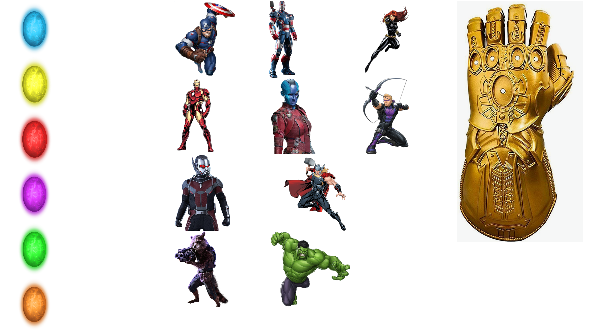

# Welcome to Workshop 2

## Javascript in practice

The game:
I hope you remember the one of the kind movie of all times that broke all records: Avengers: Endgame
During this 3-hour long movie avengers were tasked to gather all infinity stones.
In this game we will offer games to test their knowledge by asking them to match stone and avengers who found them
during the movie.
User needs to click on stone they want's to match, choose avengers who they think are responsible for finding them. And
to check that the match is correct to click on glove.
If the match is correct we will hide stone. If all matches were being made - we will show him that he won. 

video:
[](https://youtu.be/dAPTikg1uqk "Endgame game")

### Given:
Inside project, you have EndGame data. it's data about all matches that you should use to check who found which stone:
<!-- JS Block-->

```javascript
const endGameData = [{
name: "space-stone", avengers: ["captain-america", "iron-man"]
}, {
name: "mind-stone", avengers: ["ant-man", "captain-america"]
}, {
name: "reality-stone", avengers: ["rocket-raccoon", "thor"]
}, {
name: "power-stone", avengers: ["war-machine", "nebula"]
}, {
name: "time-stone", avengers: [{name: "hulk"}]
}, {
name: "soul-stone", avengers: ["black-widow", "hawkeye"]
}];
```
**_Notice that hulk is different from others_**

<br>
Also, we prepared to you 3 variable that holds reference to dom elements using querySelector method:<br>
All infinity stones. It's "iterable:<br>
<!-- JS Block-->

```javascript
const stones = document.querySelectorAll('.stone');
```

All avengers. They are "iterable" too.<br>
<!-- JS Block-->

```javascript
const avengers = document.querySelectorAll('.avenger');
```
And one infinity glove<br>
<!-- JS Block-->

```javascript
const glove = document.querySelector('.infinity_glove');
```

### Instructions:
1. Add click events for our dom elements (avengers & stones). You can use foreach loop to go over elements. e.g:
```
    stone.addEventListener('click', ({target}) => {
        onStoneClicked(target);
    });
   ```
2. When stone or avenger is clicked, store its id in matched data.
3. When glove is clicked check that stone and avengers that was chosen are matching the `endgameData`
4. If use made a wrong match show an error (alert or nice html element)
5. If user finished all matches -> congratulate him with some nice confetti
6. Each selection should be highlighted (hint: change background)
7. Have fun!

### Requirement:
- Use correct variable declarations (`let` and `const`)
- You should use high order function (at least one)
- Use object with properties (hint storing match data for example)
- You should use map, filter on arrays
- Don't forget about comparison (`===`) and `typeOf`
- Configure your vscode to put `;` on save
- Use default values for functions
- Truthy and Falsy Values

### And don't forget, most important - always go extra mile! :smiley: